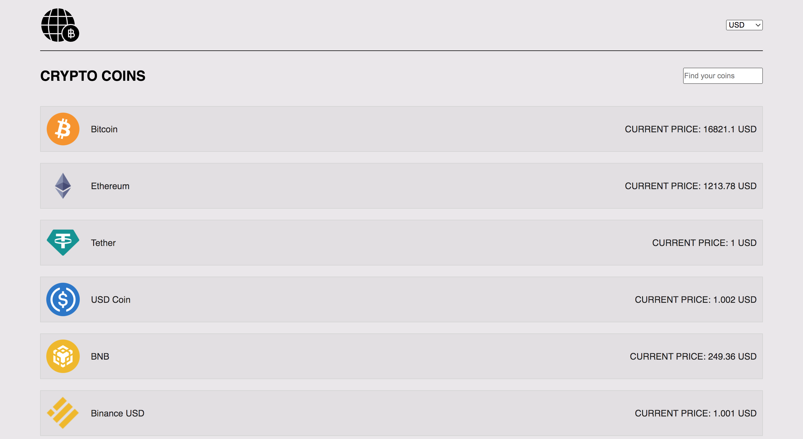

# Crypto Coins





---
Crypto Coins cryptocurrency tracking app. It has the ability to show the price in three currencies: USD, EUR, NOK.
It is possible to search for a cryptocurrency using the search option. Shows the daily rate of a cryptocurrency.


Used tools:
- https://axios-http.com/, 
- https://react-chartjs-2.js.org/,
- https://styled-components.com/


Live Site:

https://the-crypto-coins-app.netlify.app/


---
## Getting Started

### Installing

1. Clone the repo:

```bash
https://github.com/lukasznoroff/crypto-coins
```

2. Install the dependencies:

```
npm install
```

### Running


To run the app, run the following command:

```bash
npm start
```


